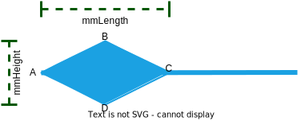

# Endpoints

In TfxDiagram all connector shapes (Lines and Curves) have two ends, a _start_ and a _finish_. An _endpoint_ is a simple shape that can be added to a connector end to provide more meaning to the diagram. For example an arrow can be added to the end of a line to indicate directionality, or in a UML class diagram a hollow arrow at the end of a line can show an inheritance relationship.

TfxDiagram provides a number of different endpoint styles, each style available in one or more sizes. The table below lists the available styles and sizes.

| Style          | Available Sizes      |
| -------------- | -------------------- |
| No Endpoint    |                      |
| Standard Arrow | medium, large        |
| Hollow Arrow   | medium, large        |
| Solid Circle   | small, medium, large |
| Hollow Circle  | small, medium, large |

The set of available endpoints can be easily extended to add new endpoint styles, e.g. a Solid Diamond Arrow and a Hollow Diamond Arrow.

## Endpoint Class Hierarchy

Endpoints are implemented in TfxDiagram by a simple class hierarchy. The base class is an abstract class called _Endpoint_ defined in the 'diagram-data-access-shape-base-class' library. Derived classes represent the various endpoint styles and can be found in the 'diagram-data-access-endpoint-classes library.


### Endpoint Class (Base Class)

_Endpoint_ is an abstract class and is the base class for the classes that provide functionality for supported endpoint styles, one class per style.

#### Properties

The _Endpoint_ class declares three public properties common to all endpoint styles. They are:

```ts
  readonly availableSizes: EndpointSize[];
  endpointType: EndpointStyle;
  size: EndpointSizes;
```

These properties are all initialised in the class constructor using values passed as parameters from the derived class contructor when an endpoint object is being instantiated.

_availableSizes_
An array of type EndpointSize objects that define what sizes are available for this endpoint. The _EndpointSize_ type is defined as:

```ts
export type EndpointSize = 'small' | 'medium' | 'large';
```

As examples the _availableSizes_ for _StandardArrow_ is set to ['medium', 'large'] and for _SolidCircle_ is set to ['small', 'medium', 'large'].

_endpointStyle_
A property of type EndpointStyle that defines the type of the endpoint. _EndpointStyle_ is defined as:

```ts
export type EndpointStyle =
  | 'none'
  | 'standard-arrow'
  | 'hollow-arrow'
  | 'solid-circle'
  | 'hollow-circle';
```

_size_
A property of type _EndpointSize_ that defines the size of the endpoint. The _EndpointSize_ type is defined as:

```ts
export type EndpointSize = 'small' | 'medium' | 'large';
```

The value of the size property must be equal to one of the sizes held in the _availableSizes_ array.

#### Abstract Getters/Setters

The TfxDiagram UI allows the user to set modal values for the start and finish endpoints, including the size of each endpoint set in the endpoint's _size_ property (see the endpoint buttons controls on the _Page Ribbon_). These modal values are applied to new connectors when they are added to a page. The UI allows the user to select a sizes for each available endpoint style, both for connector start ends and connector finish ends.

While the modal values for the start and finish endpoints retain the size of the currently selected endpoints the modal size values for each endpoint style must also be retained so that when the user returns to the endpoint buttons the endpoint sizes for all endpoint styles are as they were last set by the user, not just the currently selected modal endpoint.

This is implemented by two static properties on each non-abstract endpoint class. As an example the _SolidCircle_ endpoint class has the following static properties set:

```ts
  static modalStartSize: EndpointSize = 'medium';
  static modalFinishSize: EndpointSize = 'medium';
```

The base class, _Endpoint_ defines abstract getters and setters that must be implemented by derived non-abstract classes to set their static modal properties.

```ts
  abstract get modalStartSize(): EndpointSize;
  abstract set modalStartSize(size: EndpointSize);
  abstract get modalFinishSize(): EndpointSize;
  abstract set modalFinishSize(size: EndpointSize);
```

Again using the _SolidCircle_ class as an example, the implementation of these abstract getters/setters looks like:

```ts
  get modalStartSize(): EndpointSize {
    return SolidCircle.modalStartSize;
  }

  set modalStartSize(size: EndpointSize) {
    if (SolidCircle.availableSizesSolidCircle.includes(size)) {
      SolidCircle.modalStartSize = size;
    }
  }

  get modalFinishSize(): EndpointSize {
    return SolidCircle.modalFinishSize;
  }

  set modalFinishSize(size: EndpointSize) {
    if (SolidCircle.availableSizesSolidCircle.includes(size)) {
      SolidCircle.modalFinishSize = size;
    }
  }
```

#### Abstract Methods

The abstract _Endpoint_ class declares two abstract methods that must be implemented by all derived non-abstract classes:

```ts
  abstract copy(): Endpoint;
  abstract draw(
    p: Point,
    angle: number,
    strokeStyle: string,
    mmLineWidth: number,
    c: CanvasRenderingContext2D,
    t: Transform
  ): void;
```

_copy()_
The _copy()_ method simply returns a new endpoint instance with the same type and size as the object called. As an example the _SolidCircle_ class implements the _copy()_ method as follows:

```ts
  copy(): SolidCircle {
    return new SolidCircle(this.size);
  }
```

_draw_
The _draw()_ method renders the endpoint shape at point _p_ using the colour defined in _strokeStyle_ using the canvas rendering context _c_, transformed by the 2D transform _t_. The _angle_ property allows the endpoint to be aligned with the connector direction at the associated endpoint. See the endpoint classes for details on how the draw method is implemented.

| parameter                   | Description                                                              |
| --------------------------- | ------------------------------------------------------------------------ |
| p: Point                    | Position of connector end on page (coordinates in millimeters)           |
| angle: number               | Direction of connector at end point in radians, clockwise from 3 o'clock |
| strokeStyle: string         | Colour of endpoint defined using 6 digit hex number (with leading #)     |
| mmLineWidth: number         | Width of connector in millimeters                                        |
| c: CanvasRenderingContext2D | Rendering context for canvas                                             |
| t: Transform                | Current drawing transform for page (translation and scaling)             |

### StandardArrow Class

### HollowArrow Class

### SolidCircle Class

### Hollow Circle Class

## Endpoint Creation Factory Functions

### createStartEndpoint()

### createFinishEndpoint()

### createEndpoint()

## Adding a new Endpoint Shape - Walkthrough

Adding a new endpoint shape to TfxDiagram is a fairly straight forward process. In this walkthrough we will add a solid diamond arrow endpoint to the application.

### Adding a New Endpoint Style

The first step is to extend the _EndpointStyle_ type and add the new style to the _ENDPOINT_STYLES_ array. Both of these definitions can be found in the file 'endpoint-styles.ts' in the 'diagram-data-access-shape-base-class' library. The name of the new style is \_solid-diamond\*.

```ts
export type EndpointStyle =
  | 'none'
  | 'standard-arrow'
  | 'hollow-arrow'
  | 'solid-circle'
  | 'hollow-circle'
  | 'solid-diamond';
```

In the code snippet above the string 'solid-diamond' has been added to the EndpointStyle union type.

Next extend the ENDPOINT_STYLES constant array to include the new style:

```ts
export const ENDPOINT_STYLES: EndpointStyle[] = [
  'none',
  'standard-arrow',
  'hollow-arrow',
  'solid-circle',
  'hollow-circle',
  'solid-diamond',
];
```

> **Note**
> The type _EndpointSize_ is also defined in the file 'endpoint-styles.ts'. This union type combines a set of strings that describe potential endpoint sizes. Each endpoint created must support one or more of the size options declared in the _EndpointSize_ union type. If an endpoint style is being added that requires a size not defined in the _EndpointSize_ type then an identifier for the new size must be added to the type. For example if a new endpoint style required an extra large size then the string 'extra-large' could be added to the _EndpointSize_ type.

### Extending the _createEndpoint_ Factory Function

The file 'create-endpoint.ts' in the 'diagram-data-access-endpoint-classes' library contains three factory functions used in TfxDiagram to create new Endpoint objects when required. The functions are:

```ts
createStartEndpoint(endpointStyle: EndpointStyle): Endpoint | null;
createFinishEndpoint(endpointStyle: EndpointStyle): Endpoint | null;
createEndpoint(endpointStyle: EndpointStyle, size?: EndpointSize): Endpoint | null;
```

To add a new endpoint style only the _createEndpoint()_ function needs to be updated. Simply add a new case to the switch statement for the new endpoint style. In this case:

```ts
  switch (endpointStyle) {
    case 'standard-arrow': {
      return new StandardArrow(
        getSize(
          size ? size : StandardArrow.modalStartSize,
          StandardArrow.availableSizesStandardArrow
        )
      );
    }
    ...
    ...
    case 'solid-diamond': {
      return new SolidDiamond(
        getSize(
          size ? size : SolidDiamond.modalStartSize,
          SolidDiamond.availableSizesSolidDiamond
        )
      );
    }
  }
```

The case statement simply returns a new _SolidDiamond_ object with a size set as specified by the size parameter, or if the size parameter is undefined a size set to a valid size for the endpoint style. This is ensured by using the current modal start end endpoint size for the solid diamond endpoint style (note same pattern used for the 'standard-arrow' endpoint style).

### Implement SolidDiamond Class

The final step is to create a new class, _SolidDiamond_ derived from the _Endpoint_ base class.

#### Static Properties

Start by defining the static properties required by endpoint classes:

```ts
export class SolidDiamond extends Endpoint {
  static readonly availableSizesSolidDiamond: EndpointSize[] = ['medium', 'large'];
  static modalStartSize: EndpointSize = 'medium';
  static modalFinishSize: EndpointSize = 'medium';
  ...
  ...
}
```

Note that the _SolidDiamond_ class extends the _Endpoint_ base class. The static properties required are:

| Property                                   | Description                                                                                                                                                                                                                                   |
| ------------------------------------------ | --------------------------------------------------------------------------------------------------------------------------------------------------------------------------------------------------------------------------------------------- |
| availableSizesSolidDiamond: EndpointSize[] | Readonly array that defines the sizes implemented for the solid diamond endpoint. In this case the sizes are 'medium' and 'large'.                                                                                                            |
| modalStartSize: EndpointSize               | This holds the modal value for a diamond endpoint added to a connector start end. Note this static member should not be accessed directly - getter and setter functions are implemented in the class to provide a simple property interface.  |
| modalFinishSize: EndpointSize              | This holds the modal value for a diamond endpoint added to a connector finish end. Note this static member should not be accessed directly - getter and setter functions are implemented in the class to provide a simple property interface. |

#### Modal Size Getters and Setters

Next add the getter and setter functions to realise the abstract declarations in the _Endpoint_ base class. Thes functions implement two properties in the class; modalStartSize and modalFinishSize.

```ts
export class SolidDiamond extends Endpoint {
  ...
  ...
  get modalStartSize(): EndpointSize {
    return SolidDiamond.modalStartSize;
  }

  set modalStartSize(size: EndpointSize) {
    if (SolidDiamond.availableSizesSolidDiamond.includes(size)) {
      SolidDiamond.modalStartSize = size;
    }
  }

  get modalFinishSize(): EndpointSize {
    return SolidDiamond.modalFinishSize;
  }

  set modalFinishSize(size: EndpointSize) {
    if (SolidDiamond.availableSizesSolidDiamond.includes(size)) {
      SolidDiamond.modalFinishSize = size;
    }
  }
  ...
  ...
```

#### Diamond Head Shape Control Properties

The class defines three private properties that control how the shape is drawn.

```ts
  private mmLength: number;
  private mmHeight: number;
  private arrowBase: Point[];
```



The _mmLength_ property defines the length of the diamond arrow head in millimeters. The _mmHeight_ property will hold the height of the diamond arrow head in millimeters, and the _arrowBase_ array property will hold the coordinates of the unrotated diamond arrow head in millimeters, point A always being at (0, 0) and the x-axis increasing from left to right and the y-axis increasing fromtop to bottom.

These properties are initialised in the class contructor when a solid diamond endpoint is instantiated.

#### Class Constructor

The class constructor first initialises the base class properties _size_, _endpointType_ and _availableSizes_ by passing the required parameters to the _super()_ method. The constructor also initialises some private properties of the shape itself used by the _draw()_ method.

```ts
  constructor(size: EndpointSize = 'medium') {
    if (SolidDiamond.availableSizesSolidDiamond.includes(size)) {
      super('solid-diamond', size, SolidDiamond.availableSizesSolidDiamond);
    } else {
      super('solid-diamond', 'medium', SolidDiamond.availableSizesSolidDiamond);
    }

    this.mmLength = mmArrowLengths[this.size as 'medium' | 'large'];
    this.mmHeight = (2 * this.mmLength * arrowRatioHeight) / arrowRatioLength;
    this.arrowBase = [
      { x: 0, y: 0 },
      { x: this.mmLength / 2, y: -this.mmHeight / 2 },
      { x: this.mmLength, y: 0 },
      { x: this.mmLength / 2, y: this.mmHeight / 2 },
    ];
  }
```

The _SolidDiamond_ constructor takes a single parameter, _size_, which specifies the desired size of the endpoint. The constructor first checks that the requested size is supported by the class by checking the size is included in the array of available size (held in the readonly static property _availableSizesSolidDiamond_). If it is then the parent class (_Endpoint_) _super()_ method is called passing the endpoint style (always 'solid-diamond'), the supplied size and the array of available sizes for the solid diamond endpoint type. If the requested size is not available then the _super()_ method is called with the endpoint size set to 'medium', which is supported by the solid diamond endpoint style.

The next task for the constructor is to initialise the private properties that define the diamond shape.

The first property initialised is _mmLength_. The constant _mmArrowLength_ ('endpoint.constants.ts in project 'diagram-data-access-endpoint-classes') defines the length of the solid diamond head in millimeters for the two supported sizes.

```ts
export const mmArrowLengths = {
  medium: 3,
  large: 5,
};
```

The height of the diamond head is calculated from the set length using a ratio held in the _arrowRatio_ contant (also in 'endpoint.constants.ts') and stored in the private property _mmHeight_. The _arrowRatio_ constants is defined as:

```ts
export const arrowRatio = {
  height: 5,
  length: 16,
};
```

Finally, the constructor initialised the private property _arrowBase_ to contain the coordinates of the four diamond head vertices for a non-rotated diamond shape with origin at the leftmost vertex (point A in diagram above).

#### copy() Method

Implement the _copy()_ method which is declared as an abstract method in the base class. The _copy()_ method simply returns a new SolidDiamond endpoint object with the same size as this object.

```ts
  copy(): HollowArrow {
    return new HollowArrow(this.size);
  }
```

### draw() Method

Implement the _draw()_ method, which is declared as an abstract method in the base class. Descriptions of the _draw()_ method parameters can be fond in the Endpoint Class section above.

```ts
  draw(
    p: Point,
    angle: number,
    strokeStyle: string,
    mmLineWidth: number,
    c: CanvasRenderingContext2D,
    t: Transform
  ): void {
    // Scale for line width
    const s = (1 + mmLineWidth / mmBaseLineWidth) / 2;

    const a: Point[] = [
      pointTransform(pointAdd(this.arrowBase[0], p), t),
      pointTransform(pointAdd(pointRotate(pointScale(this.arrowBase[1], s), angle), p), t),
      pointTransform(pointAdd(pointRotate(pointScale(this.arrowBase[2], s), angle), p), t),
      pointTransform(pointAdd(pointRotate(pointScale(this.arrowBase[3], s), angle), p), t),
    ];

    c.save();
    c.strokeStyle = strokeStyle;
    c.lineWidth = 1;
    c.fillStyle = strokeStyle;
    c.beginPath();
    c.moveTo(a[0].x, a[0].y);
    c.lineTo(a[1].x, a[1].y);
    c.lineTo(a[2].x, a[2].y);
    c.lineTo(a[3].x, a[3].y);
    c.fill();
    c.restore();
  }
```

First task is to compute a scale factor to adjust the size of the endpoint to balance the line width. This is essentially the lineWidth divided by a constant base line width (set to 0.25 millimeters in the 'endpoint.contants.ts' file).

Next transform the diamond shape vertices to allow for scaling, rotation and translation. First scale the vertices using the computed scale factor _s_. Second rotate the vertices around the origin by the _angle_ parameter. Next translate the coordinates to place the diamond shape at the end of the line, as specified by the _p_ parameter. Finally transform the coordinates from page coordinates (millimeters) to viewport coordinates (pixels).

The last step in the draw process is to draw into the canvas context.
