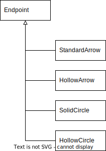

# Endpoints

In TfxDiagram all connector shapes (Lines and Curves) have two ends, a _start_ and a _finish_. An _endpoint_ is a simple shape that can be added to a connector end to provide more meaning to the diagram. For example an arrow can be added to the end of a line to indicate directionality, or in a UML class diagram a hollow arrow at the end of a line can show an inheritance relationship.

TfxDiagram provides a number of different endpoint styles, each style available in one or more sizes. The table below lists the available styles and sizes.

| Style          | Available Sizes      |
| -------------- | -------------------- |
| No Endpoint    |                      |
| Standard Arrow | medium, large        |
| Hollow Arrow   | medium, large        |
| Solid Circle   | small, medium, large |
| Hollow Circle  | small, medium, large |

The set of available endpoints can be easily extended to add new endpoint styles, e.g. a Solid Diamond Arrow and a Hollow Diamond Arrow.

## Endpoint Class Hierarchy

Endpoints are implemented in TfxDiagram by a simple class hierarchy. The base class is an abstract class called _Endpoint_ defined in the 'diagram-data-access-shape-base-class' library. Derived classes represent the various endpoint styles and can be found in the 'diagram-data-access-endpoint-classes library.



### Endpoint Class (Base Class)

_Endpoint_ is an abstract class and is the base class for the classes that provide functionality for supported endpoint styles, one class per style.

#### Properties

The _Endpoint_ class declares three public properties common to all endpoint styles. They are:

```ts
  readonly availableSizes: EndpointSize[];
  endpointType: EndpointStyle;
  size: EndpointSizes;
```

These properties are all initialised in the class constructor using values passed as parameters from the derived class contructor when an endpoint object is being instantiated.

_availableSizes_
An array of type EndpointSize objects that define what sizes are available for this endpoint. The _EndpointSize_ type is defined as:

```ts
export type EndpointSize = 'small' | 'medium' | 'large';
```

As examples the _availableSizes_ for _StandardArrow_ is set to ['medium', 'large'] and for _SolidCircle_ is set to ['small', 'medium', 'large'].

_endpointStyle_
A property of type EndpointStyle that defines the type of the endpoint. _EndpointStyle_ is defined as:

```ts
export type EndpointStyle =
  | 'none'
  | 'standard-arrow'
  | 'hollow-arrow'
  | 'solid-circle'
  | 'hollow-circle';
```

_size_
A property of type _EndpointSize_ that defines the size of the endpoint. The _EndpointSize_ type is defined as:

```ts
export type EndpointSize = 'small' | 'medium' | 'large';
```

The value of the size property must be equal to one of the sizes held in the _availableSizes_ array.

#### Abstract Getters/Setters

The TfxDiagram UI allows the user to set modal values for the start and finish endpoints, including the size of each endpoint set in the endpoint's _size_ property (see the endpoint buttons controls on the _Page Ribbon_). These modal values are applied to new connectors when they are added to a page. The UI allows the user to select a sizes for each available endpoint style, both for connector start ends and connector finish ends.

While the modal values for the start and finish endpoints retain the size of the currently selected endpoints the modal size values for each endpoint style must also be retained so that when the user returns to the endpoint buttons the endpoint sizes for all endpoint styles are as they were last set by the user, not just the currently selected modal endpoint.

This is implemented by two static properties on each non-abstract endpoint class. As an example the _SolidCircle_ endpoint class has the following static properties set:

```ts
  static modalStartSize: EndpointSize = 'medium';
  static modalFinishSize: EndpointSize = 'medium';
```

The base class, _Endpoint_ defines abstract getters and setters that must be implemented by derived non-abstract classes to set their static modal properties.

```ts
  abstract get modalStartSize(): EndpointSize;
  abstract set modalStartSize(size: EndpointSize);
  abstract get modalFinishSize(): EndpointSize;
  abstract set modalFinishSize(size: EndpointSize);
```

Again using the _SolidCircle_ class as an example, the implementation of these abstract getters/setters looks like:

```ts
  get modalStartSize(): EndpointSize {
    return SolidCircle.modalStartSize;
  }

  set modalStartSize(size: EndpointSize) {
    if (SolidCircle.availableSizesSolidCircle.includes(size)) {
      SolidCircle.modalStartSize = size;
    }
  }

  get modalFinishSize(): EndpointSize {
    return SolidCircle.modalFinishSize;
  }

  set modalFinishSize(size: EndpointSize) {
    if (SolidCircle.availableSizesSolidCircle.includes(size)) {
      SolidCircle.modalFinishSize = size;
    }
  }
```

#### Abstract Methods

The abstract _Endpoint_ class declares two abstract methods that must be implemented by all derived non-abstract classes:

```ts
  abstract copy(): Endpoint;
  abstract draw(
    p: Point,
    angle: number,
    strokeStyle: string,
    mmLineWidth: number,
    c: CanvasRenderingContext2D,
    t: Transform
  ): void;
```

_copy()_
The _copy()_ method simply returns a new endpoint instance with the same type and size as the object called. As an example the _SolidCircle_ class implements the _copy()_ method as follows:

```ts
  copy(): SolidCircle {
    return new SolidCircle(this.size);
  }
```

_draw_
The _draw()_ method renders the endpoint shape at point _p_ using the colour defined in _strokeStyle_ using the canvas rendering context _c_, transformed by the 2D transform _t_. The _angle_ property allows the endpoint to be aligned with the connector direction at the associated endpoint. See the endpoint classes for details on how the draw method is implemented.

### StandardArrow Class

### HollowArrow Class

### SolidCircle Class

### Hollow Circle Class

## Endpoint Creation Factory Functions

### createStartEndpoint()

### createFinishEndpoint()

### createEndpoint()
